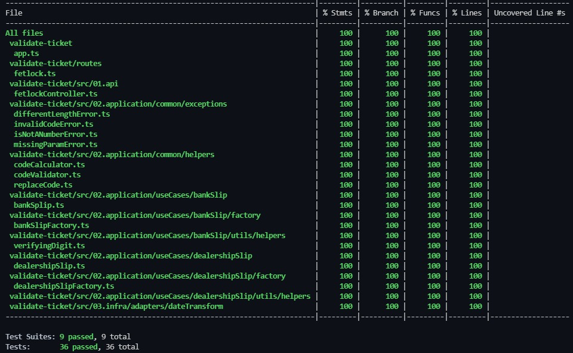

## Ticket Validation
---
#### Description
This is an implementation about bank slip and dealership slip. This application should return some informations about code inserted. In this application we are using Node.js, TypeScript and express like main skills.

---
#### Objectives
- Should be able pass a code in the param and receive some informations about that.
- Should be able work with Bank Slip and Dealership Slip
- Should be read typed lines about code

---
#### Dependecies
- Node.JS:  14.20.0
- TypeScript: 4.6.3
- Express 4.17.3
- Date-fns: 2.28.0
- Jest 27.5.1

---
#### Results of tests using TDD
In this project, I'm using TDD to implement this solution.

  

---
#### Methods to Run
	npm install
	npm start (To run application)
	npm run test:unit (To run only unit tests)
	npm run test:integration (To run only integration tests)
	npm run test:all (To run all tests)

---
#### Examples of code
	Bank slip: 21290001192110001210904475617405975870000002000
	Dealership slip: 836400000029318300863194034652180018100135235826

---
#### Request
http://localhost:8080/boleto/code

---
#### Response
	200:
	`{
		"barCode": "21290001192110001210904475617405975870000002000",
		"amount": "20.00",
		"expirationDate": "2018-07-16"
	}`
---
	400:
	`{
		"message": "Different length: 47"
	}`
---
	400:
	`{
		"message": "Is not a number: {code}"
	}`
---
	400:
	`{
		"message": "Invalid Code Error: DV"
	}`